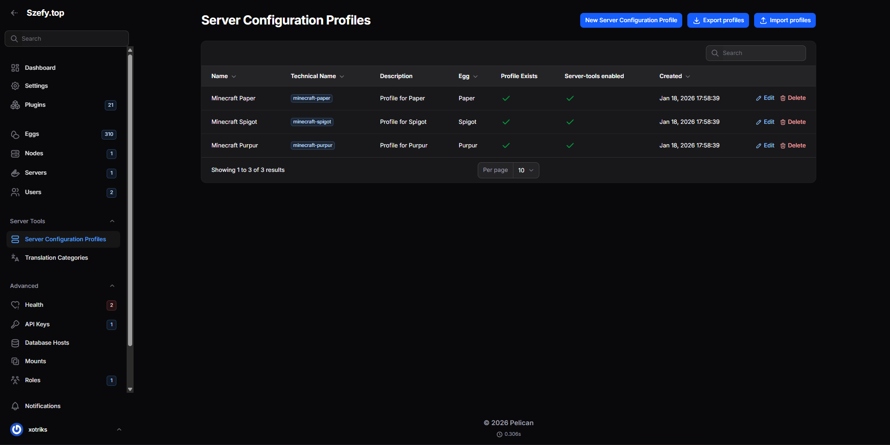
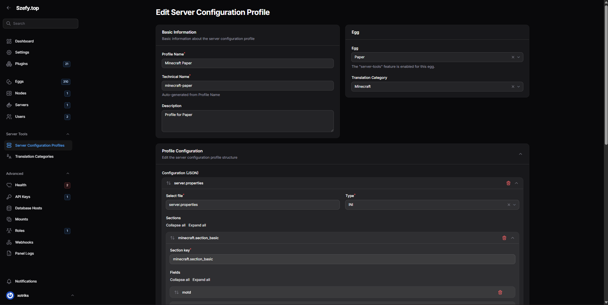
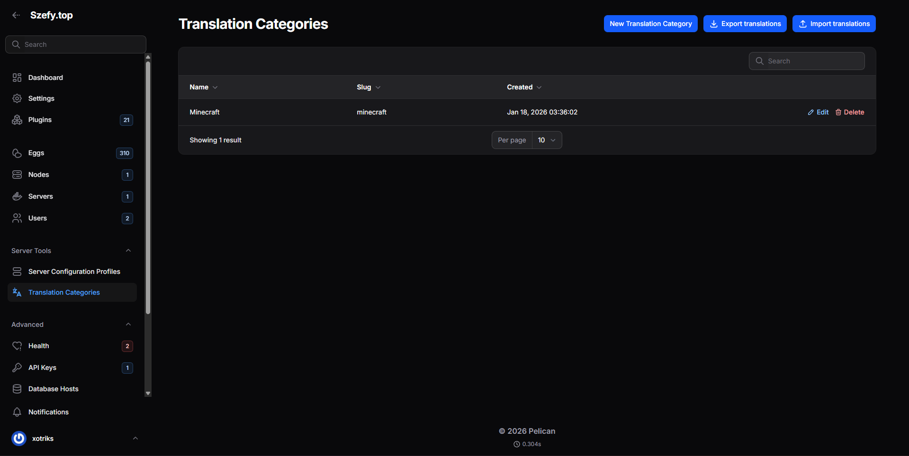
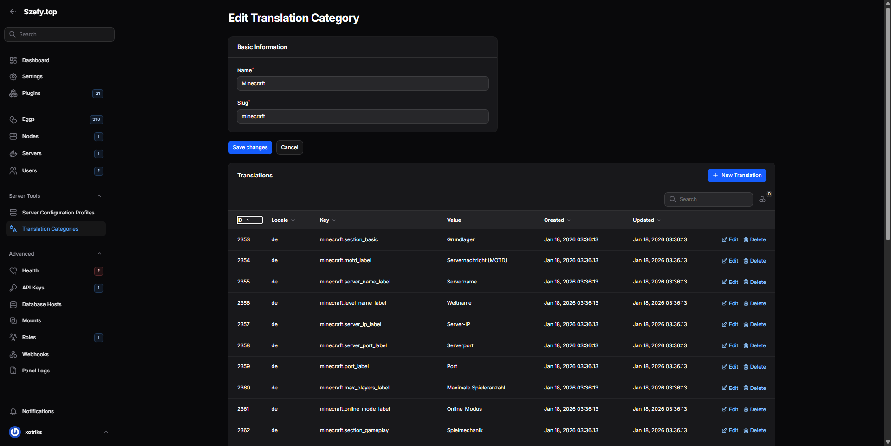
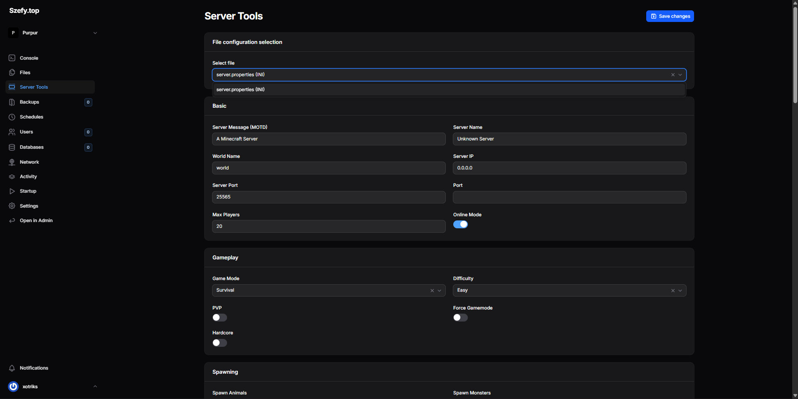

# Server Tools (Pelican Plugin)

A universal tool for editing game server configurations from the Pelican UI.

This plugin adds a structured configuration editor for server files (JSON/YAML/INI/CFG/TXT/CONF), a profile builder in the Admin panel, and per-profile translation overrides. It is designed for Pelican + Filament 4 and ships with ready-to-use Minecraft profiles.

## Table of contents

- [Features](#features)
- [Panels](#panels)
- [Installation](#installation)
- [Quick start](#quick-start)
- [Admin panel usage](#admin-panel-usage)
- [Server panel usage](#server-panel-usage)
- [Screenshots](#screenshots)
- [Profile configuration schema](#profile-configuration-schema)
- [Import/Export](#importexport)
- [Translations](#translations)
- [Seeded profiles](#seeded-profiles)
- [Commands](#commands)
- [Development notes](#development-notes)
- [Troubleshooting](#troubleshooting)
- [License](#license)

## Features

- Admin profile builder for configuration files and fields.
- Server panel editor with file selector and live form rendering.
- Supported config formats: YAML, JSON, INI, CFG, TXT, CONF.
- Field types: text, textarea, number, toggle, select.
- Per-profile translation overrides via Translation Categories.
- Export and import for profiles and translations (JSON).
- Auto-enables `server-tools` feature on eggs when profiles are saved.
- Section order persistence via `sections_order`.

## Panels

The plugin registers resources for both panels:

- **Admin panel**: configuration profiles + translation categories.
- **Server panel**: Server Tools page for editing the server files.

## Installation

1. Copy the plugin into your Pelican plugins directory:
	 `plugins/servertools`
2. Enable the plugin in Pelican.
3. Seed default profiles (optional but recommended to populate Minecraft profiles):
	 - `php artisan servertools:seeder`

> On install, the plugin attempts to run migrations automatically. On uninstall, it rolls them back and drops plugin tables.

## Quick start

1. Open **Admin → Server Tools → Server Configuration Profiles**.
2. Create or edit a profile, define files and sections, and save.
3. Assign the profile to an Egg (the plugin will ensure the egg has the `server-tools` feature).
4. Open a server that uses that egg and go to **Server Tools** in the server panel.
5. Edit values and save to update server files.

## Admin panel usage

### Profiles

Location: **Admin → Server Tools → Server Configuration Profiles**

Each profile is stored in the `server_tool_configurations` table and contains:

- `name` – display name
- `profile_name` – slug/technical identifier
- `description`
- `egg_id` – optional binding to a specific egg
- `config` – JSON schema used to render the UI
- `server_tools_enabled` – flag enabled automatically
- `translation_category_id` – optional translation category for overrides

### Translation Categories

Location: **Admin → Server Tools → Translation Categories**

Categories group translation entries by profile. Each translation entry has:

- `translation_category_id`
- `locale`
- `key`
- `value`

These values override default translation files for a given profile.

## Server panel usage

Location: **Server → Server Tools**

The page shows:

- File picker (based on the profile)
- Dynamically generated sections and fields
- Save action (writes back to the selected config file)

The page only appears when:

- The server’s egg includes the `server-tools` feature, and
- At least one matching configuration profile exists.

## Screenshots







## Profile configuration schema

Profiles are stored as JSON under `server_tool_configurations.config`.

### Top-level structure

```json
{
	"files": {
		"server.properties": {
			"type": "ini",
			"sections": {
				"minecraft.section_basic": [
					{ "type": "text", "key": "motd", "label": "minecraft.motd_label" }
				]
			},
			"sections_order": [
				"minecraft.section_basic"
			]
		}
	}
}
```

### Supported file types

- `yaml`
- `json`
- `ini`
- `cfg`
- `txt`
- `conf`

### Sections format

Two formats are supported:

1. **Array format** (ordered list of sections):

```json
"sections": [
	{
		"section_key": "minecraft.section_basic",
		"fields": [
			{ "type": "text", "key": "motd", "label": "minecraft.motd_label" }
		]
	}
]
```

2. **Map format** (key → fields):

```json
"sections": {
	"minecraft.section_basic": [
		{ "type": "text", "key": "motd", "label": "minecraft.motd_label" }
	]
},
"sections_order": ["minecraft.section_basic"]
```

If `sections_order` is present, it is used to keep the UI order stable.

### Field definition

Each field supports:

- `type` – one of: `text`, `textarea`, `number`, `toggle`, `select`
- `key` – config key in the file (supports dotted keys)
- `label` – translation key or plain text
- `options` – map of value → label (for `select`)
- `min` / `max` – numeric constraints (for `number`)

## Import/Export

There are two import/export actions in the Admin panel:

- **Profiles**: in the Profiles list header
- **Translations**: in the Translation Categories list header

### Profiles export format

```json
{
	"version": 1,
	"exported_at": "2026-01-18T12:00:00Z",
	"profiles": [
		{
			"name": "Minecraft Paper",
			"profile_name": "minecraft-paper",
			"description": "Profile for Paper",
			"egg_id": 123,
			"server_tools_enabled": true,
			"translation_category": { "name": "Minecraft", "slug": "minecraft" },
			"config": { "files": { /* ... */ } }
		}
	]
}
```

Import rules:

- Profiles are matched by `profile_name`.
- If a profile exists, it is updated; otherwise, it is created.
- Translation category is matched/created by `slug`.

### Translations export format

```json
{
	"version": 1,
	"exported_at": "2026-01-18T12:00:00Z",
	"categories": [
		{
			"name": "Minecraft",
			"slug": "minecraft",
			"translations": [
				{ "locale": "en", "key": "minecraft.motd_label", "value": "MOTD" }
			]
		}
	]
}
```

Import rules:

- Categories are matched by `slug`.
- Translations are matched by `translation_category_id`, `locale`, and `key`.

## Translations

### Default translations

All default UI translations live in:

- `resources/lang/*/admin.php`
- `resources/lang/*/common.php`

### Profile translations

Per-profile translations are stored in the database and override defaults.

Key format examples:

- `minecraft.section_basic`
- `minecraft.motd_label`
- `common.save_changes`

## Seeded profiles

The seeder ships with Minecraft profiles and auto-maps them to eggs by name:

- `minecraft-paper`
- `minecraft-spigot`
- `minecraft-purpur`

Each profile includes a detailed `server.properties` schema and a `Minecraft` translation category.

## Commands

- `php artisan servertools:seeder` – seed profiles and translations

## Development notes

### Main locations

- Admin resources: `src/Filament/Admin/Resources`
- Server page: `src/Filament/Server/Pages/ServerToolsPage.php`
- Parsers: `src/Parsers`
- Translation service: `src/Services/ServerToolTranslationService.php`

### Adding a new parser

1. Create a new parser class in `src/Parsers` with:
	 - `parseContent(string $content): array`
	 - `writeContent(array $data): string`
2. Add the type to the profile builder select in the Admin resource.
3. Map the parser in `ServerToolsPage::getParser()`.

## Troubleshooting

**Server Tools page not visible**

- Ensure the egg has `server-tools` in `features`.
- Ensure a matching configuration profile exists for the egg.

**Translations not applied**

- Verify the translation keys exist in `resources/lang` or in the DB.
- Confirm the profile is linked to the correct Translation Category.

**Import failed**

- Validate JSON structure (`profiles` or `categories` root keys).
- Ensure the uploaded file is valid JSON.

## License

Licensed under the GNU General Public License v3.0. See [LICENSE](LICENSE).
